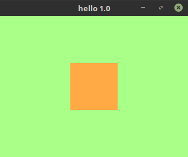

# 

[](https://travis-ci.org/alxm/faur)

*Faur* is a C framework I wrote for my video games. It runs natively on Linux and FreeBSD, and can be cross-compiled for Web, Windows, GP2X, Wiz, Caanoo, Open Pandora, and the Arduino-compatible Gamebuino META and Odroid-GO (early).

## Dependencies & Path Setup

```sh
# Required
sudo apt install build-essential git python3
sudo apt install libsdl2-dev libsdl2-mixer-dev libpng-dev

# Optional
sudo apt install libsdl1.2-dev libsdl-mixer1.2-dev mingw-w64

# Clone repo to ~/faur
cd ~
git clone git://github.com/alxm/faur.git

# Set FAUR_PATH, required
export FAUR_PATH="$HOME/faur"

# Add tools to path, optional
export PATH="$PATH:$FAUR_PATH/bin"
```

## *Hello, World*

```sh
faur-new hello
cd hello/build/make/
make run
```



Move the square with the arrow keys or a gamepad.

Here are the generated source files:

#### main.c

```c
#include <faur.h>

FStateHandler drawBox;

void f_main(void)
{
    f_state_push(drawBox);
}

void drawBox(void)
{
    static struct {
        int x, y;
    } context;

    F_STATE_INIT
    {
        context.x = f_screen_sizeGetWidth() / 2;
        context.y = f_screen_sizeGetHeight() / 2;
    }

    F_STATE_TICK
    {
        if(f_input_readKey(F_KEY_UP) || f_input_readButton(F_BUTTON_UP)) {
            context.y--;
        }

        if(f_input_readKey(F_KEY_DOWN) || f_input_readButton(F_BUTTON_DOWN)) {
            context.y++;
        }

        if(f_input_readKey(F_KEY_LEFT) || f_input_readButton(F_BUTTON_LEFT)) {
            context.x--;
        }

        if(f_input_readKey(F_KEY_RIGHT) || f_input_readButton(F_BUTTON_RIGHT)) {
            context.x++;
        }
    }

    F_STATE_DRAW
    {
        f_color_colorSetHex(0xaaff88);
        f_draw_fill();

        f_color_colorSetHex(0xffaa44);
        f_draw_rectangle(context.x - 40, context.y - 40, 80, 80);
    }

    F_STATE_FREE
    {
        f_out_info("Bye!");
    }
}
```

#### Makefile

```make
F_CONFIG_APP_AUTHOR := you
F_CONFIG_APP_NAME := hello

F_CONFIG_APP_VERSION_MAJOR := 1
F_CONFIG_APP_VERSION_MINOR := 0
F_CONFIG_APP_VERSION_MICRO := 0

include $(FAUR_PATH)/make/dev.mk
```

## Cross-Compile for Other Platforms

I first wrote Faur (formerly *a2x*) to make games for the Linux-based [GP2X handheld](https://www.alxm.org/games/gamepark.html). These are the supported platforms now:

* Linux, FreeBSD *(native)*
* Web *(Emscripten)*
* Windows *(MinGW-w64)*
* GP2X, Wiz, Caanoo *(Open2x SDK, GPH SDK)*
* Open Pandora *(Pandora SDK)*
* Gamebuino META *(Arduino SAMD)*
* Odroid-GO *(Arduino ESP32, early)*

The default toolchain paths are in faur/make/global/defs.mk and they can be overridden in ~/.config/faur/sdk.mk. To build for a different target, edit the application Makefile and replace `dev.mk` with another file from faur/make/.

## License

Copyright 2010-2019 Alex Margarit (alex@alxm.org)

* Source code licensed under [GNU GPL 3.0](https://www.gnu.org/licenses/gpl.html) (file `LICENSE`)
* Other content licensed under [CC BY-NC-ND 4.0](https://creativecommons.org/licenses/by-nc-nd/4.0/) (file `media/CC-BY-NC-ND`)

This program is distributed in the hope that it will be useful, but WITHOUT ANY WARRANTY; without even the implied warranty of MERCHANTABILITY or FITNESS FOR A PARTICULAR PURPOSE. Faur is a personal framework to support my other software; to keep it focused and manageable, it is a solo endeavor. The project is named after the old Romanian word *faur*, often used in fables to mean *wizard blacksmith*. ⚒️✨
